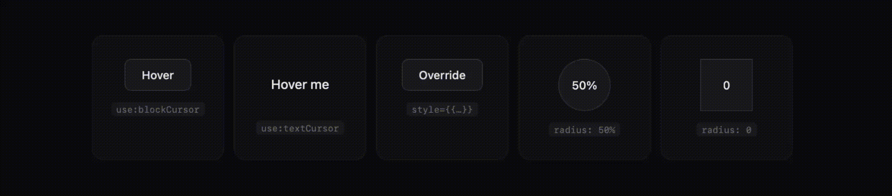

<a id="readme-top"></a>

[![Contributors][contributors-shield]][contributors-url]
[![Forks][forks-shield]][forks-url]
[![Stargazers][stars-shield]][stars-url]
[![Issues][issues-shield]][issues-url]
[![MIT License][license-shield]][license-url]

<br />
<div align="center">
  <a href="https://github.com/fernandomema/flow-cursor">
    
  </a>

  <h3 align="center">Flow Cursor</h3>

  <p align="center">
    The cursor that flows on the web — a Svelte 5 port of the iPad-cursor effect.
    <br />
    <a href="#usage"><strong>Explore the docs »</strong></a>
    <br />
    <br />
    <a href="https://github.com/fernandomema/flow-cursor">View Demo</a>
    &middot;
    <a href="https://github.com/fernandomema/flow-cursor/issues/new?labels=bug&template=bug-report---.md">Report Bug</a>
    &middot;
    <a href="https://github.com/fernandomema/flow-cursor/issues/new?labels=enhancement&template=feature-request---.md">Request Feature</a>
  </p>
</div>



<!-- TABLE OF CONTENTS -->
<details>
  <summary>Table of Contents</summary>
  <ol>
    <li>
      <a href="#about-the-project">About The Project</a>
      <ul>
        <li><a href="#built-with">Built With</a></li>
      </ul>
    </li>
    <li>
      <a href="#getting-started">Getting Started</a>
      <ul>
        <li><a href="#prerequisites">Prerequisites</a></li>
        <li><a href="#installation">Installation</a></li>
      </ul>
    </li>
    <li><a href="#usage">Usage</a>
      <ul>
        <li><a href="#action-api-recommended">Action API (recommended)</a></li>
        <li><a href="#imperative-api">Imperative API</a></li>
        <li><a href="#cursor-controller">`cursor` controller</a></li>
      </ul>
    </li>
    <li><a href="#api">API</a></li>
    <li><a href="#configuration">Configuration</a></li>
    <li><a href="#roadmap">Roadmap</a></li>
    <li><a href="#contributing">Contributing</a></li>
    <li><a href="#license">License</a></li>
    <li><a href="#contact">Contact</a></li>
    <li><a href="#acknowledgments">Acknowledgments</a></li>
  </ol>
</details>

<!-- ABOUT THE PROJECT -->

## About The Project

Flow Cursor brings the smooth, magnetic iPad-style cursor effect to any Svelte 5
app. It is a native Svelte 5 port
of [CatsJuice/ipad-cursor](https://github.com/CatsJuice/ipad-cursor), keeping the
original algorithm and defaults intact while exposing a first-class Svelte
**action** as the main entry point.

Why use it:

* **Idiomatic Svelte 5** — bind the cursor to any element with `use:flowCursor`.
* **Zero markup requirements** — no `data-cursor` attributes needed.
* **Lazy & self-cleaning** — the action auto-initialises the controller on first
  use and tears everything down when the host element is removed.
* **Imperative escape hatch** — the original `initCursor` / `updateCursor` /
  `updateConfig` API is re-exported for advanced integrations.

<p align="right">(<a href="#readme-top">back to top</a>)</p>

### Built With

* [![Svelte 5][svelte-shield]][svelte-url]
* [![TypeScript][typescript-shield]][typescript-url]
* [![Vite][vite-shield]][vite-url]

<p align="right">(<a href="#readme-top">back to top</a>)</p>

<!-- GETTING STARTED -->

## Getting Started

Add Flow Cursor to a Svelte 5 project in a few seconds.

### Prerequisites

* Node.js **>= 18**
* Svelte **^5.0.0** (peer dependency)

  ```sh
  npm create svelte@latest my-app
  ```

### Installation

1. Install the package

   ```sh
   npm install flow-cursor
   ```

2. Use the action in any component

   ```svelte
   <script>
     import { flowCursor } from 'flow-cursor';
   </script>

   <div use:flowCursor={{ type: 'block' }}>Block cursor</div>
   <span use:flowCursor={{ type: 'text' }}>Text cursor</span>
   ```

<p align="right">(<a href="#readme-top">back to top</a>)</p>

<!-- USAGE EXAMPLES -->

## Usage

### Action API (recommended)

The action is the idiomatic Svelte entry point. It runs in the browser only and
lazily initialises the controller the first time it sees a host element.

```svelte
<script>
  import { flowCursor } from 'flow-cursor';
</script>

<!-- Block cursor that hugs the host element -->
<div use:flowCursor={{ type: 'block' }}>…</div>

<!-- Text cursor: a thin vertical bar matching the host's font-size -->
<p use:flowCursor={{ type: 'text' }}>…</p>

<!-- Per-element style override (merged on top of `blockStyle`) -->
<div
  use:flowCursor={{
    type: 'block',
    style: { background: 'rgba(124, 92, 255, 0.4)', radius: '50%' }
  }}
>
  …
</div>
```

You can also pass a `data-cursor-style` compatible string:

```svelte
<div
  use:flowCursor={{ type: 'block', style: 'background: red; radius: 8px' }}
>
  …
</div>
```

#### Initial config

If you need to customise the cursor before any action runs, pass `initConfig`
to the action — it is forwarded to the lazy `init()` call:

```svelte
<div
  use:flowCursor={{
    type: 'block',
    initConfig: { enableLighting: true, adsorptionStrength: 18 }
  }}
>
  …
</div>
```

…or call `initCursor(config)` explicitly from `<script>` / `onMount`.

### Imperative API

Mirrors the original `ipad-cursor` 1:1. Useful when the action does not fit
(e.g. canvas-heavy apps or fine-grained lifecycle control).

```svelte
<script>
  import { onDestroy, onMount } from 'svelte';
  import { initCursor, disposeCursor, updateConfig } from 'flow-cursor';

  onMount(() => initCursor({ enableLighting: true }));
  onDestroy(() => disposeCursor());

  // Reactive: re-applied when `theme` changes
  $effect(() => {
    updateConfig({ normalStyle: { background: 'rgba(0,0,0,0.5)' } });
  });
</script>
```

The `data-cursor="text"` / `data-cursor="block"` attributes still work — call
`updateCursor()` after you mutate the DOM, or pass `enableAutoUpdateCursor: true`
in the config.

### `cursor` controller

The shared singleton — useful for advanced integrations or for reading
`cursor.ready` from a component.

```svelte
<script>
  import { cursor } from 'flow-cursor';
</script>

{#if cursor.ready}
  <p>Cursor is live.</p>
{/if}
```

_For the canonical types, see [`src/lib/types.ts`](./src/lib/types.ts)._

<p align="right">(<a href="#readme-top">back to top</a>)</p>

<!-- API -->

## API

### `flowCursor` action

```ts
import type { Action } from 'svelte/action';

const flowCursor: Action<HTMLElement, {
  type: 'text' | 'block' | 'normal';
  style?: IpadCursorStyle | Record<string, any> | string;
  initConfig?: IpadCursorConfig;
}>;
```

| Prop         | Type                                              | Notes                                                            |
| ------------ | ------------------------------------------------- | ---------------------------------------------------------------- |
| `type`       | `'text' \| 'block' \| 'normal'`                   | `'normal'` removes the binding.                                  |
| `style`      | `IpadCursorStyle` \| `Record<string, any>` \| `string` | Merged on top of the matching style. Accepts the legacy string. |
| `initConfig` | `IpadCursorConfig`                                | Applied on the first `init()` call only.                         |

### Functions

| Function                              | Description                                          |
| ------------------------------------- | ---------------------------------------------------- |
| `initCursor(config?)`                 | Mount the fake cursor. Idempotent.                   |
| `disposeCursor()`                     | Tear it down.                                        |
| `updateCursor()`                      | Re-scan `data-cursor` elements (imperative API).    |
| `updateConfig(config)`                | Deep-merge a config patch.                           |
| `customCursorStyle(style)`            | Build a `data-cursor-style` string.                  |
| `resetCursor()`                       | Clear any active hover.                              |
| `CursorType.TEXT` / `CursorType.BLOCK`| String constants for the imperative API.             |

<p align="right">(<a href="#readme-top">back to top</a>)</p>

<!-- CONFIGURATION -->

## Configuration

`IpadCursorConfig` mirrors the original library 1:1 — see
[`src/lib/types.ts`](./src/lib/types.ts) for the canonical reference.

| Key                      | Type                | Default          |
| ------------------------ | ------------------- | ---------------- |
| `adsorptionStrength`     | `number` (0–30)     | `10`             |
| `className`              | `string`            | `'ipad-cursor'`  |
| `blockPadding`           | `number \| 'auto'`  | `'auto'`         |
| `enableAutoTextCursor`   | `boolean`           | `false`          |
| `enableAutoUpdateCursor` | `boolean`           | `false`          |
| `enableLighting`         | `boolean`           | `false`          |
| `enableMouseDownEffect`  | `boolean`           | `false`          |
| `normalStyle`            | `IpadCursorStyle`   | (see defaults)   |
| `textStyle`              | `IpadCursorStyle`   | (see defaults)   |
| `blockStyle`             | `IpadCursorStyle`   | (see defaults)   |
| `mouseDownStyle`         | `IpadCursorStyle`   | (see defaults)   |

Each `IpadCursorStyle` accepts: `width`, `height`, `radius`, `durationBase`,
`durationPosition`, `durationBackdropFilter`, `background`, `border`, `zIndex`,
`scale`, `backdropBlur`, `backdropSaturate`. Set `radius: 'auto'` on
`blockStyle` to inherit the host element's `border-radius`.

<!-- DEVELOP -->

## Develop

```sh
npm install
npm run dev      # demo + library in one dev server
npm run check    # type-check
npm run build    # build the library
npm test         # run unit tests (vitest)
```

<p align="right">(<a href="#readme-top">back to top</a>)</p>

<!-- ROADMAP -->

## Roadmap

- [x] Svelte 5 action wrapper
- [x] Lazy controller initialisation
- [x] Re-export of the imperative `ipad-cursor` API
- [ ] SSR-safe module entry
- [ ] SvelteKit example app
- [ ] Optional reduced-motion fallback

See the [open issues](https://github.com/fernandomema/flow-cursor/issues) for a
full list of proposed features (and known issues).

<p align="right">(<a href="#readme-top">back to top</a>)</p>

<!-- CONTRIBUTING -->

## Contributing

Contributions are what make the open source community such an amazing place to
learn, inspire, and create. Any contributions you make are **greatly
appreciated**.

If you have a suggestion that would make this better, please fork the repo and
create a pull request. You can also simply open an issue with the tag
"enhancement". Don't forget to give the project a star! Thanks again!

1. Fork the Project
2. Create your Feature Branch (`git checkout -b feature/AmazingFeature`)
3. Commit your Changes (`git commit -m 'Add some AmazingFeature'`)
4. Push to the Branch (`git push origin feature/AmazingFeature`)
5. Open a Pull Request

<p align="right">(<a href="#readme-top">back to top</a>)</p>

<!-- LICENSE -->

## License

Distributed under the MIT License. See [`LICENSE`](./LICENSE) for more
information.

<p align="right">(<a href="#readme-top">back to top</a>)</p>

<!-- CONTACT -->

## Contact

Project Link: [https://github.com/fernandomema/flow-cursor](https://github.com/fernandomema/flow-cursor)

<p align="right">(<a href="#readme-top">back to top</a>)</p>

<!-- ACKNOWLEDGMENTS -->

## Acknowledgments

* [CatsJuice/ipad-cursor](https://github.com/CatsJuice/ipad-cursor) — the
  original library this project is ported from.
* [othneildrew/Best-README-Template](https://github.com/othneildrew/Best-README-Template)
  — README structure.
* [Img Shields](https://shields.io) — for the badge assets.

<p align="right">(<a href="#readme-top">back to top</a>)</p>

<!-- MARKDOWN LINKS & IMAGES -->
<!-- https://www.markdownguide.org/basic-syntax/#reference-style-links -->
[contributors-shield]: https://img.shields.io/github/contributors/fernandomema/flow-cursor.svg?style=for-the-badge
[contributors-url]: https://github.com/fernandomema/flow-cursor/graphs/contributors
[forks-shield]: https://img.shields.io/github/forks/fernandomema/flow-cursor.svg?style=for-the-badge
[forks-url]: https://github.com/fernandomema/flow-cursor/network/members
[stars-shield]: https://img.shields.io/github/stars/fernandomema/flow-cursor.svg?style=for-the-badge
[stars-url]: https://github.com/fernandomema/flow-cursor/stargazers
[issues-shield]: https://img.shields.io/github/issues/fernandomema/flow-cursor.svg?style=for-the-badge
[issues-url]: https://github.com/fernandomema/flow-cursor/issues
[license-shield]: https://img.shields.io/github/license/fernandomema/flow-cursor.svg?style=for-the-badge
[license-url]: https://github.com/fernandomema/flow-cursor/blob/master/LICENSE
[svelte-shield]: https://img.shields.io/badge/Svelte-5-4A4A55?style=for-the-badge&logo=svelte&logoColor=FF3E00
[svelte-url]: https://svelte.dev/
[typescript-shield]: https://img.shields.io/badge/TypeScript-3178C6?style=for-the-badge&logo=typescript&logoColor=white
[typescript-url]: https://www.typescriptlang.org/
[vite-shield]: https://img.shields.io/badge/Vite-646CFF?style=for-the-badge&logo=vite&logoColor=white
[vite-url]: https://vitejs.dev/
